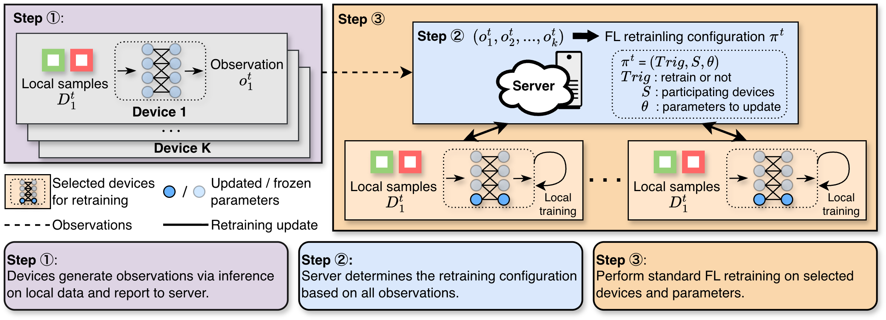

# DriftGuard

## About the Research

Federated Learning (FL) enables distributed model training across Internet of Things (IoT) devices without sharing raw data. However, in real-world deployments, data distributions on devices evolve over time—a phenomenon known as data drift. Unlike the synchronous data drift typically assumed in continual learning, drift in FL occurs *asynchronously*, with different devices shifting at different times and toward different distributions. Mitigating asynchronous data drift through FL retraining is challenging because frequent retraining incurs substantial computational overhead on resource-constrained devices, while infrequent retraining leaves drifting devices underperforming for extended periods. **DriftGuard**, a novel federated continual learning framework, is developed to address this problem.

**DriftGuard** adopts a Mixture-of-Experts (MoE) inspired architecture that decomposes the model into shared parameters capturing globally transferable knowledge and local parameters adapting to group-specific data distributions. This decomposition enables two complementary retraining strategies: *global retraining*, which updates shared parameters only when system-wide drift is detected, and *group retraining*, which selectively updates local parameters for device groups identified through a clustering mechanism based on MoE gating patterns, without requiring devices to exchange raw data. Compared to classic federated continual learning, personalized federated learning, and clustering-based methods, **DriftGuard** achieves the highest or comparable accuracy while reducing total retraining cost by up to 80%, leading to up to 2.3× higher accuracy per unit retraining cost.

## DriftGuard Framework

DriftGuard performs FL retraining under asynchronous data drift in three steps.

**Step 1**: At each time step $t$, devices perform local inference and report observations to the server.

**Step 2**: The server determines the retraining configuration $\pi^t=(Trig,S,\theta)$, which specifies whether to retrain ($Trig$), which devices participate ($S$), and which parameters to update ($\theta$). 

**Step 3**: If retraining is triggered, the selected devices perform FL retraining on the specified parameters.

<div align="center">
  

  <p><b>Fig 1. The DriftGuard Framework. </b></p>
</div>

## Code Instructions

### Quick Start

Get DriftGuard running in 5 minutes:

```bash
# 1. Setup environment
cd DriftGuard
uv sync
source .venv/bin/activate

# 2. Download datasets
gdown --fuzzy "https://drive.google.com/file/d/1L80a-vKEQnugGFvZjFYYCiqm0E8I4jVY/view?usp=sharing"
unzip datasets.zip

# 3. Start Ray first
ray start --head

# 4. Run the launcher
python src/driftguard/cli.py

# 5. View results
ls results/
```

`src/driftguard/cli.py` connects to Ray with `address="auto"`, so a Ray head node must already be running before you start the launcher.

## Project Structure

```bash
DriftGuard/
├── src/driftguard/
│   ├── data/              # Dataset metadata loading, domain sampling, and drift simulation
│   ├── federate/          # Client/server FL logic, retraining config, clustering, and aggregation
│   ├── model/             # Model definitions and training utilities
│   ├── protocol/          # Shared protocol types
│   ├── rpc/               # RPC server/client helpers
│   ├── runtime/           # Runtime interfaces and Ray actor wrappers
│   ├── cli.py             # Main experiment launcher
│   ├── config.py          # Logging setup
│   ├── exp.py             # Experiment combinations for datasets, models, and strategies
│   └── recorder.py        # Per-client result recording to JSON
├── datasets/              # Dataset metadata and extracted files
│   ├── dg5/               # DG5
│   ├── drift_domain_net/  # Drift-DomainNet
│   └── pacs/              # PACS
├── figs/                  # Figures used in README
├── results/               # Output JSON files written by each client
├── config.json            # Root configuration consumed by cli.py
├── pyproject.toml         # Project dependencies and packaging metadata
└── README.md              # Project overview and usage instructions
```

### Environment Setup

**Requirements:**

- This project uses `uv` to manage the Python environment and dependencies.
- Install `uv` by following: https://docs.astral.sh/uv/getting-started/installation/

To install the required dependencies, navigate to the `DriftGuard/` directory and run:

```bash
uv sync
source .venv/bin/activate 
```

### Dataset Preparation

This project uses three datasets in the experiments: `DG5`, `PACS`, and `DomainNet`.

In the `DriftGuard/` directory, download the dataset using:

```bash
gdown --fuzzy "https://drive.google.com/file/d/1L80a-vKEQnugGFvZjFYYCiqm0E8I4jVY/view?usp=sharing"
```

After downloading, unzip the dataset:

```bash
unzip datasets.zip
```

### Configuration

Before running the code, configure the root-level `config.json`. The current launcher reads this file directly.

| Parameter | Description | Type |
|-----------|-------------|------|
| `datasets` | Dataset list. Valid values in the current code are `DG5`, `PACS`, `DOMAINNET` | list[string] |
| `models` | Model list. Valid values are `CRST_S`, `CRST_M`, `CVIT`, `CVIT_S` | list[string] |
| `strategies` | Strategy list. Valid values are `Never`, `FCL-AveTrig`, `FCL-perDevice`, `PFL-AveTrig`, `PFL-perDevice`, `Cluster-based `, `DriftGuard` | list[string] |
| `retraining_thresholds` | Accuracy threshold used by non-DriftGuard retraining strategies | float |
| `global_retraining_thresholds` | Multiplier applied to `retraining_thresholds` for DriftGuard global retraining. For example, `0.9` means the global retraining threshold is `0.9 * retraining_thresholds` | float |
| `clustering_distance` | Clustering distance threshold for grouping clients | float |
| `min_cluster_size` | Minimum cluster size for group retraining | int |
| `gpu_per_client` | Ray GPU fraction reserved by each client training task | float |
| `pi` | Enable distributed real-device scheduling with Ray custom resources | bool |

Example configuration:
```json
{
  "datasets": ["DG5"],
  "models": ["CRST_S"],
  "strategies": ["DriftGuard"],
  "retraining_thresholds": 0.9,
  "global_retraining_thresholds": 0.9,
  "clustering_distance": 0.3,
  "min_cluster_size": 2,
  "gpu_per_client": 0.05,
  "pi": false
}
```

### Running Experiments

#### Local / Single-Machine Run

On a single machine, start a local Ray head and then launch DriftGuard:

```bash
ray start --head
python src/driftguard/cli.py
```

This will:

1. Load the dataset specified in the config
2. Connect to the existing Ray runtime
3. Simulate asynchronous data drift on devices
4. Execute the selected retraining strategies
5. Save results to the `results/` directory

#### Distributed Experiments on Real Devices

For a real distributed deployment, the current code relies on Ray cluster resources rather than `--mode server` / `--mode client` commands.

```bash
# On the server / head node
ray start --head --resources='{"server": 1}'

# On each worker device
ray start --address=<head-ip>:6379 --resources='{"client": 20, "training_node": 20}'

# Back on the server / head node
python src/driftguard/cli.py
```

Requirements for real-device runs:

1. Set `"pi": true` in `config.json`. When `pi` is `false`, the launcher does not request the custom Ray resources used for server/client placement.
2. Start Ray before launching `python src/driftguard/cli.py`.
3. The node that provides the `server` resource must also contain the dataset directory under the project root, i.e. `DriftGuard/datasets/`. The launcher resolves dataset metadata from the server-side repository root.
4. Register the required custom resources on the Ray nodes. The current launcher uses them as follows:
   - `server`: the data service actor and federated server actor run on nodes with `server` resources
   - `client`: each client actor requires `1` unit of `client`
   - `training_node`: each training task requires `1` unit of `training_node`
5. Size the cluster resources to match your deployment plan, because actor placement and training placement depend on these Ray resource labels.

### Results

Experiment results are automatically saved in the `results/` directory with the following structure:

``` bash
results/
├── [dataset]-[model]-[strategy]/
    ├── c_0.json
    ├── c_1.json
    └── ... (one file per client)
```

Each client result file contains two top-level fields:

- `acc`: a list of `[timestep, accuracy]`
- `cost`: a list of `[timestep, trained_parameters, trained_epochs, epoch_times]`, where `epoch_times` is a list of per-epoch training times

## Citation

If you use DriftGuard in your research, please cite our paper:

```bibtex
@article{DriftGuard2024,
  title={DriftGuard: Adaptive Federated Learning for Model Heterogeneity and Asynchronous Data Drift},
  author={[Your Name]},
  journal={IEEE Internet of Things Journal},
  year={2024}
}
```
